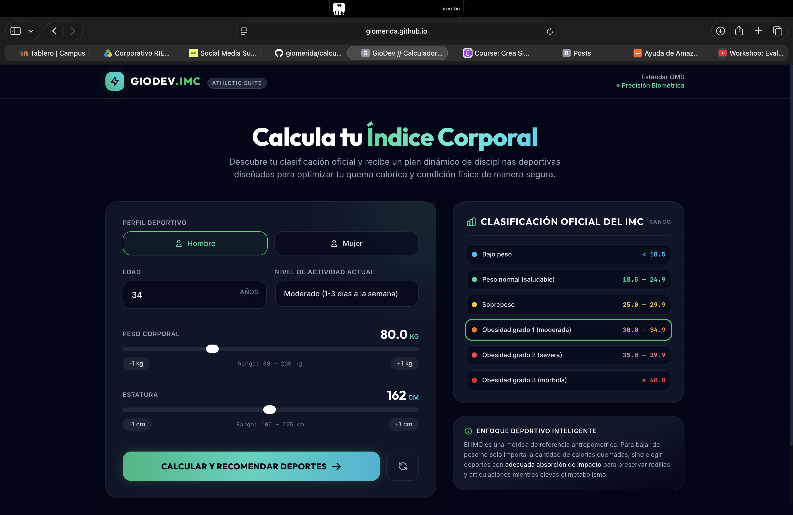
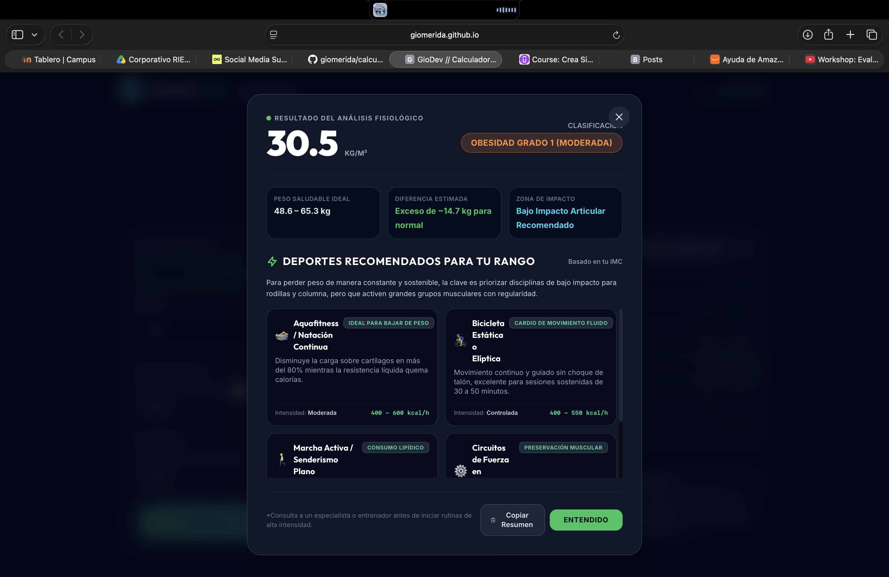
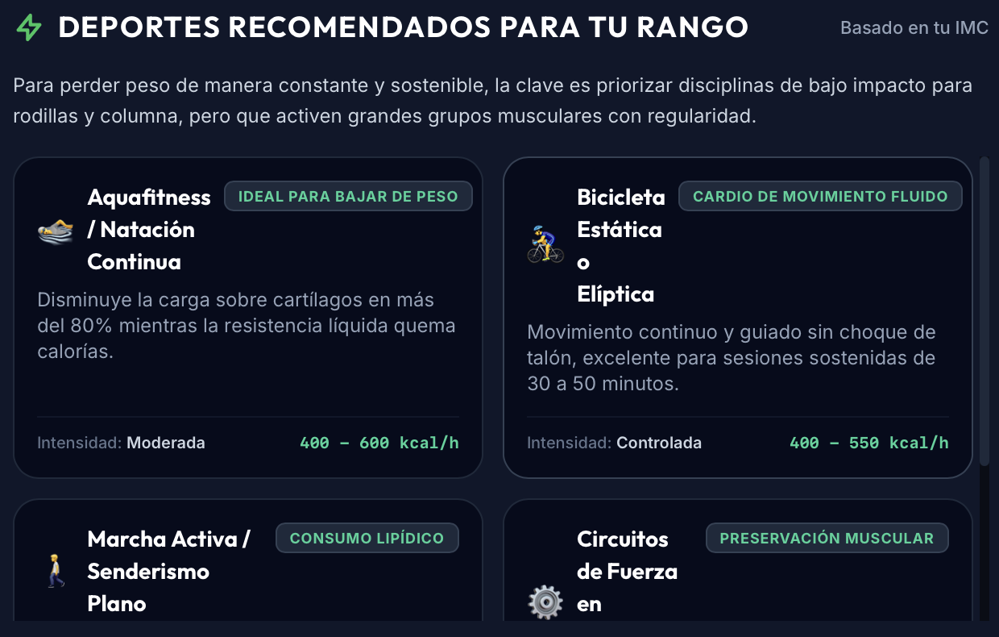

# ⚖️ Calculadora de IMC y Rendimiento — GioDev IMC Athletic Suite


**GioDev.IMC Athletic Suite** es una calculadora de **Índice de Masa Corporal (IMC)** que, además de clasificar el resultado según los estándares oficiales de la **OMS**, genera una **recomendación personalizada de deportes y disciplinas** según el perfil del usuario (edad, sexo, nivel de actividad y resultado del IMC).

> 🧪 **Nota:** Este es un **ejercicio de programación** desarrollado con fines de práctica y portafolio. Se utilizó **Inteligencia Artificial** para generar la lógica de **recomendación de deportes** acorde al resultado del cálculo de IMC. No sustituye una evaluación médica o nutricional profesional.

🔗 **Demo en vivo:** [https://giomerida.github.io/calculadoraimc/](https://giomerida.github.io/calculadoraimc/)

---

## 📋 Tabla de Contenidos

- [Sobre el proyecto](#-sobre-el-proyecto)
- [Capturas de pantalla](#-capturas-de-pantalla)
- [Tecnologías utilizadas](#-tecnologías-utilizadas)
- [Instalación y uso](#-instalación-y-uso)
- [Cómo funciona](#-cómo-funciona)
- [Clasificación oficial del IMC](#-clasificación-oficial-del-imc)
- [Recomendación de deportes con IA](#-recomendación-de-deportes-con-ia)
- [Estructura del proyecto](#-estructura-del-proyecto)
- [Roadmap](#-roadmap)
- [Aviso importante](#-aviso-importante)
- [Autor](#-autor)

---

## 📌 Sobre el proyecto

Este proyecto nace como un **ejercicio práctico de programación** para reforzar lógica de cálculo, manipulación del DOM y diseño de interfaces interactivas en JavaScript. Va un paso más allá de una calculadora de IMC tradicional: toma el perfil deportivo del usuario (sexo, edad, nivel de actividad actual, peso y estatura) y, usando **IA** para generar el criterio de recomendación, sugiere **disciplinas deportivas** acordes al rango de IMC obtenido — priorizando siempre la seguridad articular y un enfoque de impacto progresivo.

**Datos que calcula y clasifica automáticamente:**

- Resultado del IMC en `kg/m²`
- Clasificación oficial (Bajo peso → Obesidad grado 3)
- Rango de peso saludable ideal según la estatura ingresada
- Diferencia estimada respecto al rango óptimo
- Zona de impacto articular recomendada (libre, moderado, controlado, etc.)
- Recomendación de deportes específicos para el perfil

---

## 📸 Capturas de pantalla

### 🧮 Formulario — Perfil Deportivo



### 📊 Resultado del Análisis Fisiológico



### 🏃 Deportes Recomendados



---

## 🛠️ Tecnologías utilizadas

| Tecnología               | Uso                                                                            |
| ------------------------ | ------------------------------------------------------------------------------ |
| **HTML5**                | Estructura del formulario y resultados                                         |
| **CSS3**                 | Estilos, animaciones y diseño responsivo                                       |
| **JavaScript (Vanilla)** | Lógica de cálculo del IMC, clasificación, rango saludable y copiar resumen     |
| **IA (asistida)**        | Generación del criterio/lógica de recomendación de deportes según rango de IMC |
| **GitHub Pages**         | Hosting y despliegue continuo                                                  |

---

## 🚀 Instalación y uso

Este proyecto no requiere instalación de dependencias ni backend. Solo clona el repositorio y abre el archivo principal.

### Clonar el repositorio

```bash
git clone https://github.com/giomerida/calculadoraimc.git
cd calculadoraimc
```

### Ejecutar localmente

```bash
# Con Python 3
python -m http.server 8080

# Con Node.js
npx serve .
```

Visita `http://localhost:8080` en tu navegador.

### Despliegue en GitHub Pages

El proyecto está listo para desplegarse directamente en GitHub Pages activando esta opción en la configuración del repositorio.

---

## ⚙️ Cómo funciona

1. Selecciona tu **sexo** (Hombre / Mujer).
2. Ingresa tu **edad** en años.
3. Selecciona tu **nivel de actividad actual**:
   - Sedentario (poco o ningún ejercicio)
   - Moderado (1–3 días a la semana)
   - Activo (4–6 días a la semana)
   - Intenso (Atleta / doble sesión)
4. Ingresa tu **peso corporal** (rango: 30–200 kg) con controles de ±1 kg.
5. Ingresa tu **estatura** (rango: 100–225 cm) con controles de ±1 cm.
6. Presiona **"Calcular y Recomendar Deportes"**.
7. El sistema muestra:
   - Tu resultado de IMC en `kg/m²`
   - Tu clasificación oficial según la OMS
   - Tu rango de peso saludable ideal
   - Tu zona de impacto articular recomendada
   - Una lista de **deportes recomendados** para tu perfil específico
8. Puedes usar el botón **"Copiar Resumen"** para compartir tu resultado.

---

## 📊 Clasificación oficial del IMC

| Clasificación               | Rango (kg/m²) |
| --------------------------- | ------------- |
| Bajo peso                   | < 18.5        |
| Peso normal (saludable)     | 18.5 – 24.9   |
| Sobrepeso                   | 25.0 – 29.9   |
| Obesidad grado 1 (moderada) | 30.0 – 34.9   |
| Obesidad grado 2 (severa)   | 35.0 – 39.9   |
| Obesidad grado 3 (mórbida)  | ≥ 40.0        |

> **Fórmula utilizada:** `IMC = Peso (kg) / [Estatura (m)]²`

---

## 🤖 Recomendación de deportes con IA

El **"Enfoque Deportivo Inteligente"** del sistema parte de la premisa de que el IMC es solo una métrica antropométrica de referencia — para bajar de peso de forma segura no solo importa la cantidad de calorías quemadas, sino elegir **deportes con adecuada absorción de impacto** que preserven rodillas y articulaciones mientras se eleva el metabolismo.

Para construir esta lógica de recomendación (qué disciplinas sugerir según el rango de IMC, nivel de actividad y zona de impacto articular), se utilizó **Inteligencia Artificial** como apoyo en el diseño del criterio de sugerencias deportivas — combinando el resultado numérico con el perfil de actividad física del usuario para generar una recomendación más contextualizada que una simple tabla fija.

> ⚠️ El sitio recomienda expresamente: _"Consulta a un especialista o entrenador antes de iniciar rutinas de alta intensidad."_

---

## 📁 Estructura del proyecto

```
calculadoraimc/
├── index.html          # Página principal con formulario y resultados
├── css/                 # Hojas de estilo
├── js/                   # (Sugerido) Lógica de cálculo y recomendación
└── README.md            # Este archivo
```

---

## 🗺️ Roadmap

- [ ] Agregar gráfica visual de evolución del IMC (historial con localStorage)
- [ ] Exportar resultado como imagen o PDF descargable
- [ ] Ampliar el catálogo de deportes recomendados por zona de impacto
- [ ] Agregar calculadora complementaria de porcentaje de grasa corporal
- [ ] Modo oscuro
- [ ] Internacionalización de unidades (lb / in) para usuarios fuera de México

---

## ⚠️ Aviso importante

Esta calculadora es un **proyecto de práctica/ejercicio de programación** con fines educativos y de portafolio. El IMC es una métrica de referencia general y **no diagnostica condiciones de salud**; las recomendaciones de deportes generadas no sustituyen la valoración de un médico, nutriólogo o entrenador certificado.

---

## 👨‍💻 Autor

Desarrollado por **Giodev**

- 🌐 Sitio web: [giomerida.dev](https://giomerida.dev)
- 🐙 GitHub: [@giomerida](https://github.com/giomerida)

---

<div align="center">

© 2026 **GioDev.IMC Performance Suite** — Evaluación de Composición Corporal
_Proyecto de práctica realizado por GioDev._

</div>
